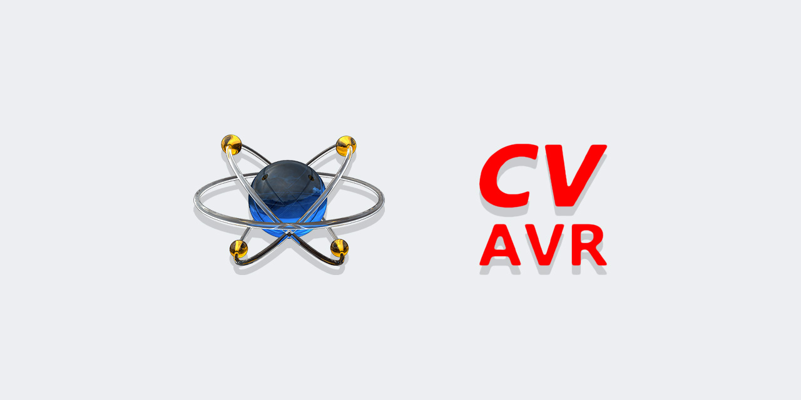
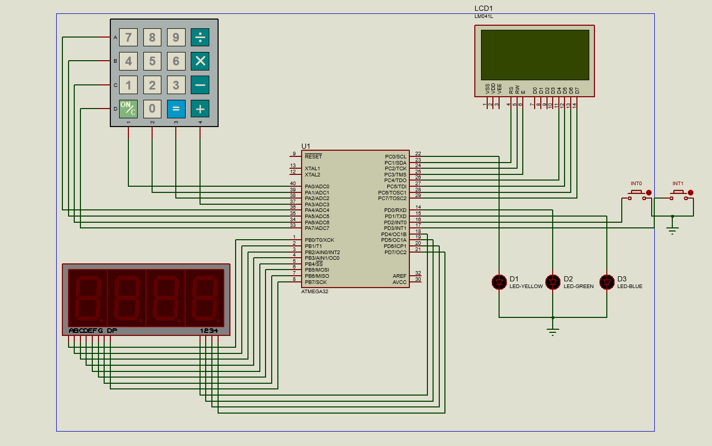

# Microprocessor Lab

Experiments with Proteus and CodeVisionAvr based on ATmega32

| # | Title |
| --- | --- |
| 1 | [Interrupt count](src/1) |
| 2 | [Flashing lights](src/2) |
| 3 | [Show digits](src/3) |
| 4 | [Show 4 digits](src/4) |
| 5 | [Timer](src/5) |
| 6 | [Read from keypad and display on LCD](src/6) |
| 7 | [Read from keypad and display on 7Segment](src/7) |
| 8 | [Read from keypad and display on 2 boards](src/8) |
| 9 | [Flashing on 2 boards](src/9) |
| 10 | [Math Game](src/10) |
| 11 | [Flowing board](src/11) |

## Author
**Rabist** - view on [LinkedIn](https://www.linkedin.com/in/rabist)

## Details
- **Course:** Microprocessor Laboratory - Undergraduate
- **Teacher:** Dr. Parisa Ostovari
- **Univ:** Yazd University
- **Semester:** Spring 1400

## License
Licensed under [MIT](LICENSE).
